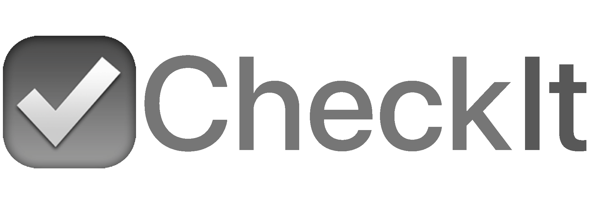

<div align="center">
  <div>&nbsp;</div>
   
</div>

## Introduction

CheckIt is a _minimalist_, _modern_ and _secure_ checklist app created for quickly writing down
action points. Secure by nature (as no file, network, or environment access is needed).

## Motivation

Motivated by the necessity to familiarize myself with react-dnd for a job opportunity, CheckIt was born, aiming to provide a practical project for honing my skills while also serving as a useful tool for managing tasks efficiently.

## Getting Started

Starting CheckIt is as simple as running the following command:

```sh
npm i && npm run dev
```

## License
CheckIt is distributed under the terms of the MIT License. Free for both commercial and research use.